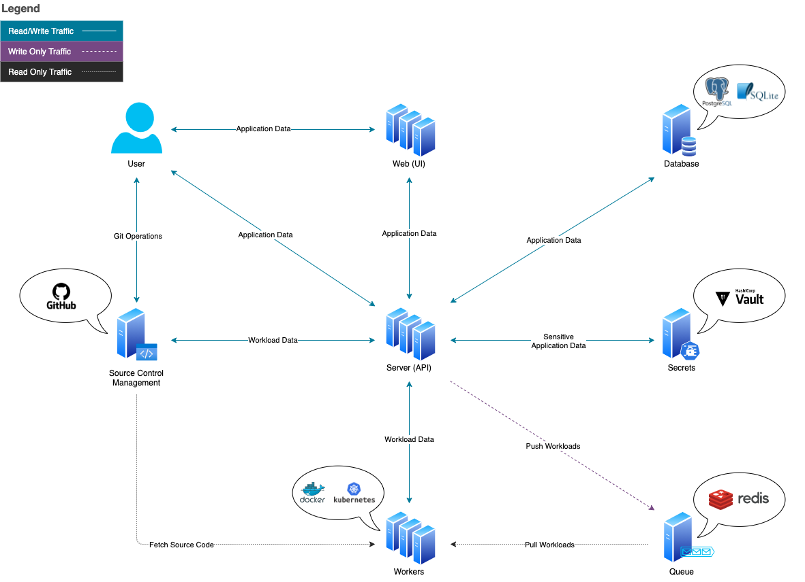

Vela is an open-source, Pipeline Automation ([CI/CD](https://www.redhat.com/en/topics/devops/what-is-ci-cd)) platform built on [Linux container](https://linuxcontainers.org/) technology.

Using a syntax similar to [Docker Compose](https://docs.docker.com/compose/) to define the configuration,
Vela uses a syntax similar to Docker Compose to define its configuration. This structure for repeated use, within the application, is called a pipeline and a single execution of a pipeline is referenced as a build.

There is no public cloud offering for Vela, so it can only be deployed as an on-premises solution.

that enables completing tasks within your software development life cycle.

## Services

There are 3 core services that make up Vela:
